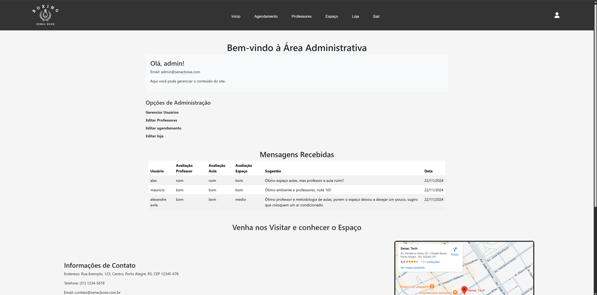

# 🏋️‍♂️ Sistema de Gestão – Academia de Lutas

Este projeto é um sistema completo para uma academia de lutas, desenvolvido com PHP e MySQL. Nele, estão implementadas funcionalidades que vão desde o agendamento de aulas, cadastro e gerenciamento de professores, atualização de imagens e preços da loja, até uma área administrativa para gerenciar a academia e coletar feedbacks dos alunos.

---

## 📋 Funcionalidades

- **Agendamento de Aulas:** Permite aos alunos marcar e gerenciar seus horários de treino.
- **Cadastro de Professores:** Gerencia a inscrição, dados e atualizações de informações dos instrutores.
- **Loja Virtual:** Exibe produtos (Luvas, equipamentos e outros itens) com a possibilidade de alterar imagens e preços.
- **Área Administrativa:** Painel completo para gerenciar usuários, professores, agendamentos e feedbacks dos alunos.
- **Feedback dos Alunos:** Módulo onde os alunos podem enviar suas opiniões e sugestões sobre a academia e os professores.
- **Integração com Banco de Dados:** Todas as informações são registradas e consultadas via MySQL, permitindo um gerenciamento robusto e centralizado.

---

## 🔧 Tecnologias Utilizadas

- **Back-end:** PHP 7.x/8.x  
- **Banco de Dados:** MySQL  
- **Front-end:** HTML5, CSS3, JavaScript (eventuais interações ou validações)  
- **Administração e Relatórios:** Implementado com PHP e formulários interativos
---

## 📸 Capturas de Tela

Abaixo, alguns exemplos da interface:





---

## ▶️ Como Executar Localmente

Para rodar o sistema em ambiente local, siga os passos abaixo:

1. **Pré-requisitos:**  
   - Instale o [XAMPP](https://www.apachefriends.org/) ou outro servidor Apache com suporte a PHP e MySQL.

2. **Configuração do Projeto:**  
   - Clone o repositório:
     ```bash
     git clone https://github.com/Xandi-avila/Site-academia.git
     ```
   - Copie os arquivos do projeto para a pasta `htdocs` do XAMPP (ou configure um Virtual Host).

3. **Banco de Dados:**  
   - Abra o [phpMyAdmin](http://localhost/phpmyadmin) e crie um banco de dados (ex.: `academia_lutas`).
   - Importe o arquivo SQL (`senac_boxe.sql`) para o banco criado.
   - Atualize as configurações de conexão no arquivo `conexao.php`, utilizando os dados corretos (host, usuário, senha e nome do banco).

4. **Acessando o Sistema:**  
   - Inicie o servidor Apache e MySQL pelo XAMPP.
   - Acesse o sistema via navegador:  
     `http://localhost/nome-da-pasta`  
     (onde “nome-da-pasta” é a pasta onde você colocou o projeto).

---

## ✍️ Autor

Desenvolvido por **Alexandre Avila**  
[GitHub](https://github.com/Xandi-avila) • [LinkedIn](https://www.linkedin.com/in/alexandre-de-avila/)

---

